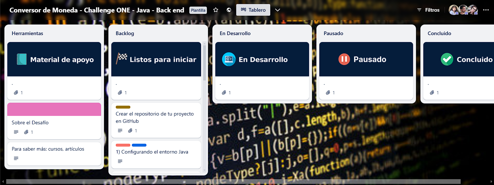
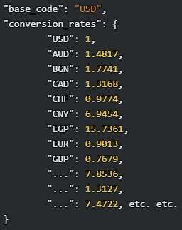
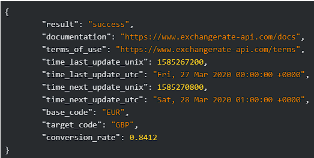
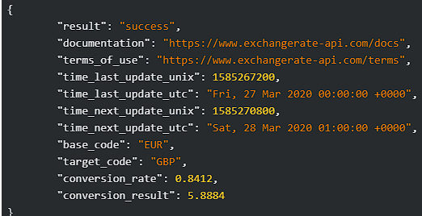
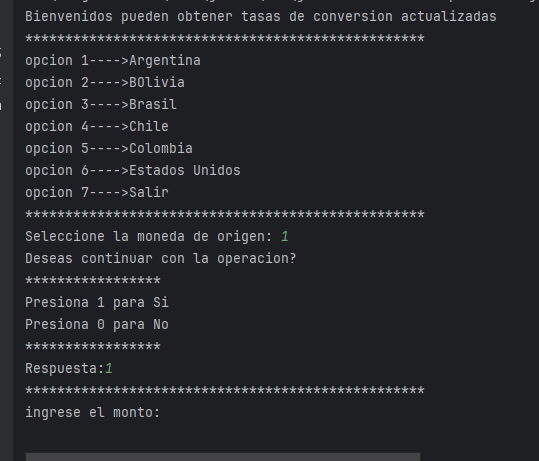
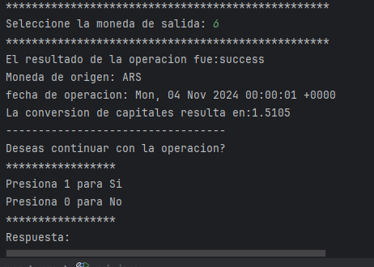
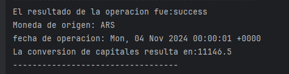
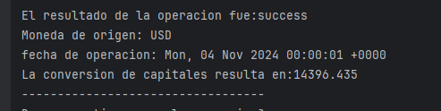
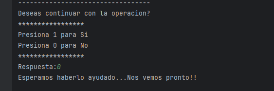
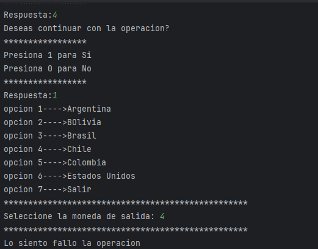

# **Bienvenidos**

## 🚀 Presentacion 🚀

Buenas soy Agustin y como parte del programa [ONE de oracle](https://www.oracle.com/ar/education/oracle-next-education/) quiero compartir con ustedes el desarrollo
de mi primer Aplicacion java como desafio para [Alura Latam](https://www.aluracursos.com/).
Fue todo un desafio pasar de las ideas en mi cabeza de modelado UML al que estaba acostumbrado por mi carrera de estudio a codificar en java. Seguramente es un codigo que se puede mejorar,
limpiar,modularizar y hacerlo mas eficiente,pero como mi primer desafio es un gran paso. A lo largo de las descripciones iré dejando algunas ideas para posibles mejoras  

---
## ⭐ Requisitos ⭐
A continuacion describiré los softwares usados durante el proyecto y librerias que no pueden faltar.  

Los softwares principales usados durante el proyecto son:

>🟢 [Intellij IDEA](https://www.jetbrains.com/idea/download/?section=windows) en su version gratituita como entorno del proyecto.
>
>🟢 [Postman](https://www.postman.com/) para estudiar los resultados de mis peticiones de manera mas comoda y rapida.
>
>🟢 [Git bash](https://git-scm.com/downloads) una herramienta muy poderosa  para llevar versionados del proyecto.  
> 
Si te sentis comodo usando otro tipo entornos sos libre de hacerlo!
Hay numerosas alternativas como por ej.
+ eclipse
+ visual estudios
+ NetBeans
+ Insomnia(en vez de usar postman)  

---
✅Es fundamental para el manejo de la notacion JSON el uso de la libreria ___[Gson](https://mvnrepository.com/artifact/com.google.code.gson/gson/2.11.0)___
A traves de esta libreria podremos manipular la informacion obtenida del servidor de la pagina web.  
🧑‍💻️ Deben descargarla e incorporarla al proyecto. Tambien pueden optar por configurar Maven en su sistema para tener acceso a la misma.

>En el siguiente enlace encontraran toda la documentacion para manipular la informacion  ___🔹[Libreria GSON](https://github.com/google/gson)🔹___

☑️Una alternativa a Gson es Usar ___🔹Jackson🔹___ otra libreria que permite manipular Json para convertir la informacion en algo util para nuestro proyecto.
Para usarla deberan realizar las implementaciones pertinente de los metodos en los que utilice Gson
---
## 💻--Introduccion--💻

#### A continuacion voy a describir  brevemente un poco lo que es modelo y los metodos y funcionamiento.

Les comparto el desafio propuesto por alura [Trello](https://trello.com/b/RU41cvaQ/conversor-de-moneda-challenge-one-java-back-end)

> En primer lugar el funcionamiento basico es un conversor de Divisas. Se ingresa la moneda de origen,el monto y la moneda de destino.

💣 _Todo programa debe ser **robusto** asi que nos aseguramos con bloques ___🔒try-catch🔒___ que nuestra aplicacion puede **manejar excepciones** ante un uso inadecuado por parte del **usuario**._   
En cualquier punto de la operacion el usuario puede arrepentirse y simplemente finalizar.

💬 _Es tedioso tener tantos puntos para salir,pero si estuvieramos en una interfaz grafica estaria siempre disponible con un boton.
Podria tenerse en cuenta que el usuario quiera cambiar de operacion, salir o simplemente modificar un campo en un version futuro_
 
>Toda la gestion antes mencionada es realizada por el main de forma que nunca lleguen datos incorrectos a nuestro **Objeto Moneda.**  

---
### CLASE MONEDA  
La clase Moneda poseee Atributos **privados**  con sus respectivos **Getters and Setters**  para la manipulacion de datos.  
No queremos que el programador modifique como si nada nuestros datos.
+ private  float cantidad;
+ private String entrada;
+ private String salida;

Recordando que el menu de entrada es manejado todo con enteros implementamos una clase abstracta **TasaDeConversion** como base interna de referencia para realizar la conversion automatica 

~~~
public abstract class TasaDeConversion {
    private static final Map<Integer, String> opcionesMenu = new HashMap<>();
    static {
        opcionesMenu.put(1, "ARS");
        opcionesMenu.put(2, "BOB");
        opcionesMenu.put(3, "BRL");
        opcionesMenu.put(4, "CLP");
        opcionesMenu.put(5, "COP");
        opcionesMenu.put(6, "USD");}
    public static String getOpcion(int codigo) {return opcionesMenu.get(codigo);}
~~~
_Este Diseño responde al funcionamiento de la API proporcionada_

💬 _Podria usar switch o condicionales, pero este implementacion es mas practica y limpia.  
> _Se gestiona de forma externa a otras clases y permite agregar rapidamente mas Bases sin alterar el funcionamiento o requerir mucho trabajo_

### 📶--API--📶

>pagina utilizada durante el proyecto [Exchange Rate API](https://www.exchangerate-api.com/docs/java-currency-api)  

_En el sitio tendran acceso a toda la documentacion y gestionar su **API-KEY gratuita**._  
**Cada moneda se Representa con una clave de 3 letras mayusculas "ABC"**

En base a esto tenemos varias maneras de preparar  nuestra **Request**.   
pero antes de arrancar necesitaran importar las siguiente librerias:
+ URI para crear direcciones  

Perteneciente a paquetes HTTP de java las librerias
+ Response
+ Client
+ Request

_La primera opcion consiste en cargar la moneda de entrada obtener la tasa de salida de todo el conjunto de tasas obtenido y realizar la conversion manualmente_

  

📚Por motivos de seguridad la direccion no estará cargada deben obtener su Key y cargarla en el **campo direccion**
>GET https://v6.exchangerate-api.com/v6/YOUR-API-KEY/latest/USD    

_🔵Cargamos la direccion con la clave y la base de la moneda "ARS","USD"_

La segunda opcion proviene de cambiar la palabra ___latest___ por **pair** como indica la documentacion podran cargar una segunda moneda de esta forma obtenemos unicamente la tasa de dicho pais y no un conjunto quedando pendiente realizar la conversion de Divisas solamente

> GET https://v6.exchangerate-api.com/v6/YOUR-API-KEY/pair/Mon-Origen/Mon-Salida     
> 
La tercera opcion es igual que la anterior con un parametro extra para indicar el monto de la base de entrada  
> 

> GET https://v6.exchangerate-api.com/v6/YOUR-API-KEY/pair/ORG/SAL/1500    
> 
De esta forma resta obtener el resultado nada mas, la conversion fue realizada automaticamente por la API

~~~
private String getSolicitud() {
        String direccion = "https://v6.exchangerate-api.com/v6/2958c704ea28742fd07d154c/latest/";
        String datos="null";
      try {
       HttpClient client = HttpClient.newHttpClient();
        HttpRequest request = HttpRequest.newBuilder()
                .uri(URI.create(direccion + this.entrada))
                .build();
        HttpResponse<String> respuesta = client
                .send(request, HttpResponse.BodyHandlers.ofString());
        datos=respuesta.body();}
      catch (IOException | InterruptedException e) {
          e.printStackTrace();
return  "Lo siento intenta mas tarde estamos experimentando problemas con el servidor" ;}
      return datos;}
~~~

📚Como pueden observar utilicé la primera alternativa. Tambien observarán que no forma parte de la interfaz publica es un metodo **PRIVATE**. Todo se gestiona internamente en forma automatica.  
📚Para convertirlo en algo util para nuestros propositos Incorporamos la libreria **Gson¨**  y la usamos en el metodo **Transform**
~~~
private static   Tasas transform(String respuesta){
    Gson gson = new Gson();
   Tasas aux=gson.fromJson(respuesta, Tasas.class);
return  aux;}}
~~~
El metodo **transform** extrae del String en formato JSON solo las claves que resultan utiles para nuestros propositos y las guarda en una clase **Record** llamada **Tasas**   
 🔵Pueden ver que tampoco es publico ya que es usado por otro metodo

📚En Tasas implementamos el metodo **findRate** Usando el metodo get perteneciente a Map encuentro a partir del atributo de salida como clave el valor de la tasa 
>public   Float findRate(String pais){return  rates.get(pais);}

Por ultimo realizamo el producto de la tasa por la cantidad y lo mostramos todo desde **calculoTransformado();**  
💬Como no tenia necesidad unicamente lo muestro y no lo retorno, Ademas en tasas guardamos el resultado de la request y la fecha para mostrar campos importantes de la operacion 

Pueden realizar N operaciones si es necesario y quedan guardadas en una **LIST**
💬queda pendiente el implementar un metodo que muestre las multiples operaciones quizas en futuras versiones

---
## 🗃️--Documentacion--🗃️  
Aunque ya fui dejando enlaces a lo largo de la descripcion les  proporciono otros usados   

🔸 [Documentacion de java](https://docs.oracle.com/en/java/javase/17/docs/api/index.html) Documentacion de todas las clases y metodos junto con sus implementaciones   
🔸[Atajos Intellij](https://resources.jetbrains.com/storage/products/intellij-idea/docs/IntelliJIDEA_ReferenceCard.pdf) Atajos de teclado para explotar el potencial del entorno  
🔸[Libreria GSON](https://github.com/google/gson?tab=readme-ov-file) Manual de uso de las herramientas que proporciona Gson   
🔸[Documentacion API](https://www.exchangerate-api.com/docs/standard-requests) Todas las descripciones que realicé se encuentran detalladas ahi junto con otras consultas que podes realizar  
🔸[Descripcion de clases de java](https://www.aluracursos.com/blog/estructura-datos-con-java) un resumen de las collecciones y otras estructuras que te pueden ser util  
🔸[Clase HTTP Client](https://docs.oracle.com/en/java/javase/17/docs/api/java.net.http/java/net/http/HttpClient.html) Les dejo a mano la clase que les permite construir su request  

---
## 📲📲--CASOS DE PRUEBA--📲📲️    

___Tene en cuenta que la actualizacion de las tasas se actualiza cada dia no te preocupes si los resultados no coinciden dentro de cierto margen de error___  

>Convertiremos de $$ argentinos a Dolar Estadounidense

>>>   

>Cargamos la moneda de origen y el monto   **$1500**
 

>>> 
> + Observamos el resultado exitoso de la request
> + La moneda Base
> + La fecha de la operacion
> + Y el resultado en Dolares  
 

Ya podemos realizar otra operacion si deseamos
> 
>convertimos de pesos argentinos a colombianos  
> 
>    

> Probemos convertir 15 Dolares a la moneda chilena   
    

>Por ultimo probemos salir   
>>>  
 
>Te dejo un ejemplo para que veas que un error no interrumpe el flujo de ejecucion     

>>> 

